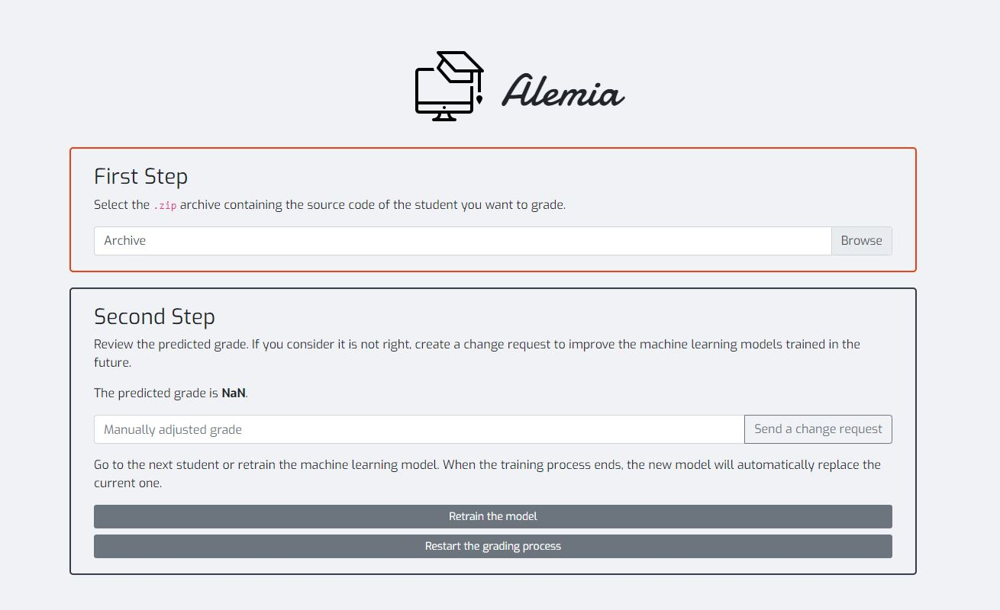
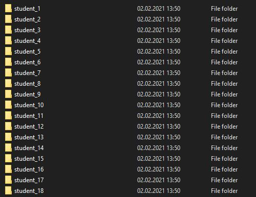
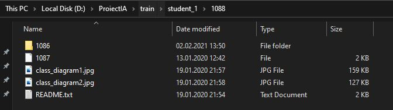
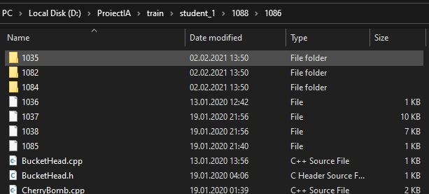

# Input format #2

Alemia este o platforma demonstrativa ce arata cum tehnica de machine learning poate corecta automat proiecte de programare orientata pe obiecte.

Odata deschisa aplicatia, putem observa ca este necesar sa introducem un fisier .zip. Acesta trebuie sa contina unul sau mai multe fisiere in care se gasesc mai multe documente ale studentilor.

In cazul in care se doreste sa se evalueze nota unui singur student, se poate realiza o arhiva cu un singur fisier, fisier ce curpinde toate documentele .cpp si .h.

Continutul fisierului TestStudent:

Alemia ne va evalua nota astfel:

In cazul in care se doreste evaluarea mai multor note, fisierele trebuie sa respecte formatul primit ca test:

Alemia va evalua notele astfel:

