#  State-of-the-art in domeniul predictiei notelor studentilor, daca inputurile sistemului ar consta in fisiere sursa de programare (.cpp, .h, .java, .html, .py, .ipynb)

# Introducere

În cursurile de inginerie software cu mulți studenți, este adesea imposibil ca un profesor să ofere o recenzie detaliată a proiectului software p  entru fiecare student. Notele pot fi date în orice mod dorește profesorul, insă de obicei asta se rezumă doar la a pune întrebări și a evalua răspunsurile. Cele mai ușoare întrebări sunt cele ale cărui răspuns sunt clar și definit, precum răspunsurile multiple. Astfel de examene pot fi introduse în calculator și evaluate automat, iar nota va fi dată studenților în aceeași zi. Pe de altă parte, exista și examene ale căror întrebare și răspuns sunt cumva ambigue si deschise la păreri, iar studentul trebuie să-și facă propria parere și să o interpreteze; în acest caz, nota poate fi diferită în funcție de student și nu se cunoaște rezultatul final.
Programarea este undeva la mijloc. Fiind o materie logică și tehnică, programarea sugerează ca fiecare problemă prezentată de profesor s-ar putea să aibă o singură soluție corectă, în timp ce studenții sunt puși să răspundă printr-un cod sursă. Prin crearea unui instrument ajutător ce are rolul de a evalua codul, se poate reduce timpul petrecut de profesori ca să evaluze sursele respective.

Scopul este unul simplu: Profesorii să petreacă mai puțin timp corectând, iar notele studenților să fie egale cu munca lor și să primească un feedback pozitiv.
Pentru a realiza asta, trebuie să răspundem la 3 întrebări:
- Ce fel de evaluator de cod sursă există deja, și cum pot fi folosite în machine learning?
- Ce funcții și metrice pot fi folosite pentru acest obiectiv?
- Cum ar putea machine learning sa funcționeze când evaluează examenele?

Programul de evaluare automata folosit în această teză și experimentul sunt construite cu ajutorul scikit-learn, un set de instrumente de machine learning din python.

# Alte instrumente

Exista o mulțime de instrumente de evaluare disponibile, precum Web-CAT și AutoGradr pentru educație, DOMjudge și Mooshak pentru competiții de programare, Hackerrank pentru recrutare și propriul instrument al TDT4100 , JExercise. Dar toate aceste teste au un lucru în comun: acestea se folosesc de teste pentru a realiza evaluarea.  Un motiv pentru care există atâtea moduri de evaluare pentru diferite exerciții, însă niciunul pentru examene, este acela că exercițiile sunt menite să învețe oamenii cum să programeze, însă nu și să le testeze modul de a programa și cât au învățat ei să facă asta. Prin refolosirea unor sarcini pentru a preda, sarcinile respective pot fi îmbunătățite între timp, însă este opusul atunci când vine vorba de examene, unde sarcinile sunt refăcute, schimbate și/sau devin întâmplătoare cu fiecare an ce trece pentru a face testele să fie nepredictibile.

# Testarea

Testarea reprezintă un modul în care putem vedea dacă un program merge cum trebuie. Aceasta este acceptată și rezonabilă doar dacă outputul reprezintă cea mai importantă parte a programului. Acest lucru nu se dovedește a fi folositor la un examen, unde deși un cod poate să nu ruleze, el poate fi foarte bun parțial sau să ia chiar un scor suficient de bun deoarece a fost scris astfel încât sa fie foarte aproape de răspunsul corect.

# Parsarea

Parsarea se referă la procesul analizării limbajului, fie el natural sau în programare, ca secvență de simboluri. Aceste analize trebuie sa fie urmate strict, când vine vorba de formatul gramatic, însă când ne referim la cod, rezultatul poate fi un arbore abstract de sintaxe; un arbore de structură ce reprezintă segmente de cod ca noduri și condiții/ierarhizări ca muchii.

Ca un instrument de evaluare a cerințelor și examenelor de programare, parsarea se folosește pentru a căuta similarități între soluțiile studentului și cele corecte. Asta poate fi realizat prin realizarea unui arbore până la soluție și să se compare arborele respectiv cu arborele realizat de student. Pentru o mai bună analiză, se sugerează oferirea fiecărui pas un număr de importanță.

Singurul dezavantaj în cazul acesta îl reprezintă faptul că dacă programul nu compilează, acesta trebuie luat "la mână" pentru a vedea fiecare simbol ce reprezintă. Codurile cu o multitudine de erori pot returna la rândul lor o eroare, ce va duce la analiza greșită a codului.

# Expresii

Există gurpări de cuvinte ale căror utilizare este diferită daca le privim separat. Un exemplu clar de expresie în programare îl reprezintă utilizarea listelor în Python. Majoritatea - dacă nu chiar toate - limbajele de programare au for-loops, care pot if folosite pentru a popula o listă cu numere. În python, for-loop-ul poate arăta așa:

my_list = []
for i in range(10):
    my_list.append(i)

În ziua de azi, exemplele de expresii pot include detectarea de buguri și crearea codului folosindu-ne de template-uri, în adiție cu instrumente ce pot detecta și extrage expresii folosite între mai multe proiecte.

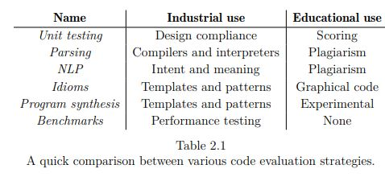

# Evaluarea

In ziua de azi, testarea este un simplu proces, însă nu unul ușor de dus la capăt: După ce studenții au completat examenul, îl trimit profesorului iar acesta le va evalua manual, pe fiecare în parte.

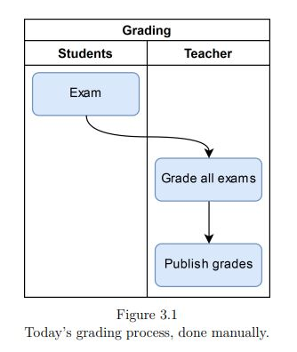

O altă metodă ar putea fi aceea în care se folosește un instrument. Astfel, profesorul ar trebui să corecteze câteva lucrări ce vor fi folosite mai tarziu ca exemplu.

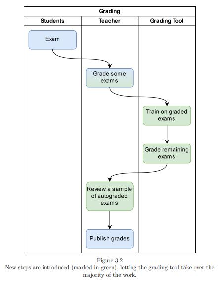

Pentru a permite codului să funcționeze alături de machine learning, acesta trebuie să fie transformat în valori numerice ce pot fi analizate. Pentru a face asta, au fost puse mai multe întrebări:
- Cât de complex e codul? Acesta poate fi comparat cu ideea de simplicitate, adică cât de ușor este codul de citit. Pentru asta, putem folosi metoda lui Halstead pentru măsurarea complexității.
- Cât de similar este examenul dat de student cu soluția profesorului? În cazul în care considerăm că răspunsul profesorului este cel ideal, de la similaritate până la soluție se va considera răspuns corect. În următoarea poză se compară soluția studentului și a profesorului în utilizarea de vectori și de conținut al acestora.

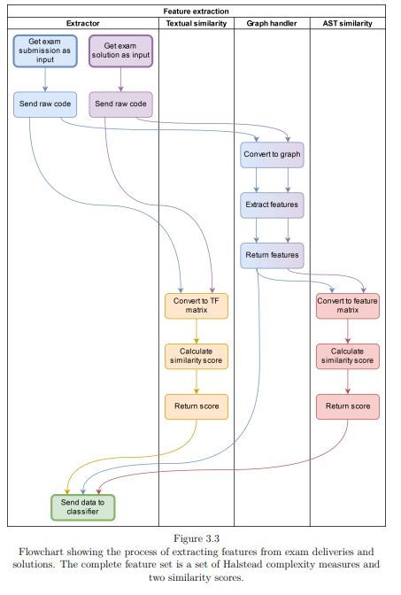

Dacă a fost necesar la început să citim date, acum este necesar să extragem diferite metode și funcții. Este necesară diferențierea de variablile, valori, metode, cuvinte cheie, etc. Un mod de a obtine aceste informatii il reprezinta crearea unui AST (Abstract Syntax Tree). 

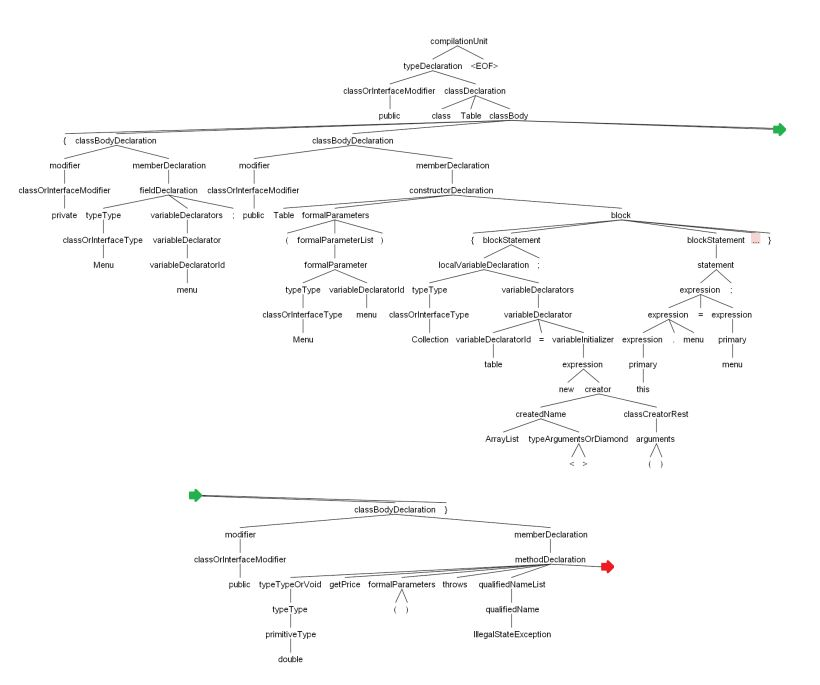

# Masurile de complexitate Halstead

Măsurile de complexitate Halstead sunt indicatorii software introdusi de Maurice Howard Halstead în 1977 ca parte a tratatului său privind stabilirea unei științe empirice a dezvoltării de software. Halstead a făcut observația că valorile software-ului ar trebui să reflecte implementarea sau exprimarea algoritmilor în diferite limbi, dar să fie independente de execuția lor pe o platformă specifică.

Scopul lui Halstead a fost de a identifica proprietățile măsurabile ale software-ului și relațiile dintre acestea. Acest lucru este similar cu identificarea proprietăților măsurabile ale materiei (cum ar fi volumul, masa și presiunea unui gaz) și relațiile dintre acestea (analog cu ecuația gazului, astfel, valorile sale nu sunt de fapt doar valori de complexitate.

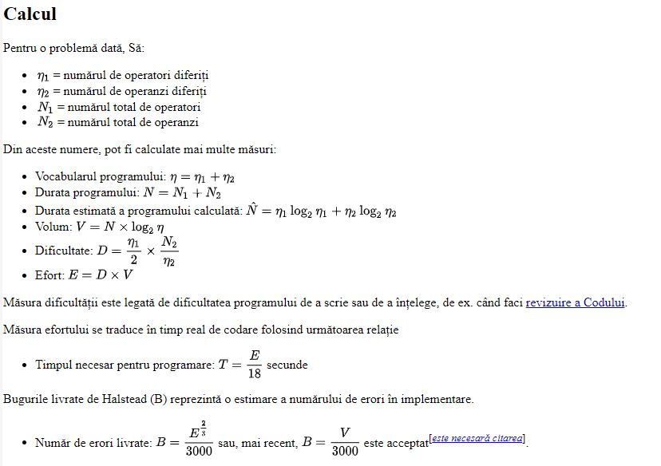

# Similaritatea codului

Prima măsură de similaritate se bazează pe statistica obținută din informațiile primite, numită TF-IDF (Term Frequency / Inverse Document Frequency). TF-IDF reprezintă o măsură de cuvinte, simboluri și numere dintr-un document sau mai multe documente unde TF numără fiecare cuvânt în orice secvență izolată de text și IDF verifică numărul de aparințe ale acestuia în proiect.

În acest context, fiecare răspuns al unui subtask este un document, și o colecție de răspunsuri de la studenți pentru un subtask este un corpus. TF-ul de la fiecare document va fi reprezentat ca un vector. Prima linie reprezintă numele acestor token-uri, iar fiecare linie mai jos reprezintă numărul de apariții al acestor token-uri în fiecare document.

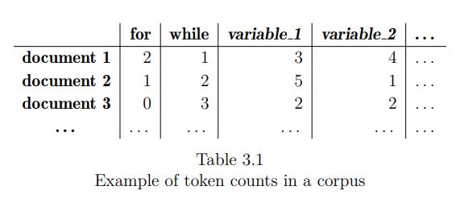

IDF se folosește pentru a acorda mai puțină importanță cuvintelor ce apar în multuple documente dintr-un corpus. Problema apare însă în faptul că limbajul de programare este oarecum restrictiv. Asta ar însemna să nu ofere nicio valoare cuvintelor obișnuite (de ex, să nu ofere aloare numelor de variabile) și să ofere valoare mare variabilelor și metodelor cu nume obscure. De aceea s-a renunțat la IDF.

Însă a avea doar o matrice TF nu este suficient. Un scor va trebui dat fiecărui document (subtask) pentru a indica similaritatea cu documentul soluție. Astfel, se va adauga documentul soluție la matricea TF.

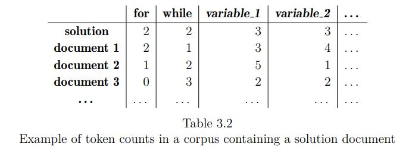

Apoi, fiecare linie a documentului se transforma într-un vector.

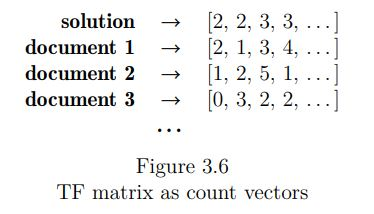

În final, fiecărui document i se oferă un scor de similaritate (distinsa), calculat cu formula urmatoare

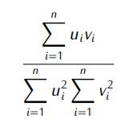

unde:
u,v = vectori
n = lungimea vectorului

Deoarece distanta reprezintă o valoare între 0 și 1, unde o distantă mai mare reprezintă o similaritate mai mică, atunci similaritatea reprezintă inversa distanței.

Similaritate = 1 - distanță

Nu există un avantaj direct între utilizarea similaritatei și distanței, doar una pentru a face totul mai ușor.

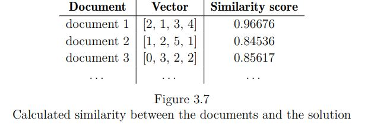

# Similaritatea AST

O a doua masură de similaritate o reprezintă combinația de măsură a complexității a lui Halstead. Aceasta urmărește următoarele acțiuni:
- Crearea AST
- Extragerea măsurătorilor Halstead din AST
- Extragerea a 3 măsurături suplimentare din toate AST-urile, și anume dacă codul conține for-loops, while-loops și if-statements
- Crarea unui vector pentru fiecare subtask, conținând măsurătorile Halstead și cele 3 măsurători suplimentare
- Calcularea similarității dintre soluție și cele trimise de studenți.

# Antrenare și predicție

# Machine learning

Machine learning reprezintă un sistem ce este capabil sa se antreneze pe sine în realizarea unei acțiuni, fără a fi nevoie de un programator să introducă explicit valori sau funcții. Aceasta este foarte folositoare când vine vorba de observarea unui pattern (unor valori ce se întalnesc mai des decât altele); completarea task-urilor unde știm ce tip de râspuns vrem, dar nu și cum să ajungem exact la acesta.

# scikit-learn

Scikit-learn reprezintă un set de utilitare în Python folosite pentru machine learning, data mining și analysis. Cele mai importante funcții ar fi:

- train_test_split -> ia listele ca input și le împarte în noi liste folosite pentru antrenare și testare (de ex, o listă de 12 elemente va fi returnată cu 9 elemente(pentru antrenare) și 3 elemente (pentru testare) )

- fit -> funcție folosită să antreneze un clasificator, unde seturile de antrenament din train_test_split sunt folosite ca input

- predict -> este folosit dupa antrenarea clasificatorului, va prezice clase pentru noul input (prezice notele pentru urmatoarele examene primite)

# Clasificatorul

Pentru ajutarea evaluării codurilor din examene este necesar un tip de mașină numit clasificator. Acesta este un fel de ajutător al rezolvării problemelor. Acesta primește diferite informații și un grup finit de categorii (sau clase), și verifică care este clasa a cărei input se potrivește cel mai bine.

Pentru examenele noastre, acesta va clasifica notele studenților de la F la A (1 la 10). Însă, există câteva elemente care pot ajuta la un răspuns mai clar, cum ar fi un flowchart din scikit-learn ce se numește scikit-learn algorithm cheat sheet. Scopul acestuia este să ofere tuturor un punct de start bazat pe setul de date ce este folosit, și care ar trebui să fie output-ul algoritmului.

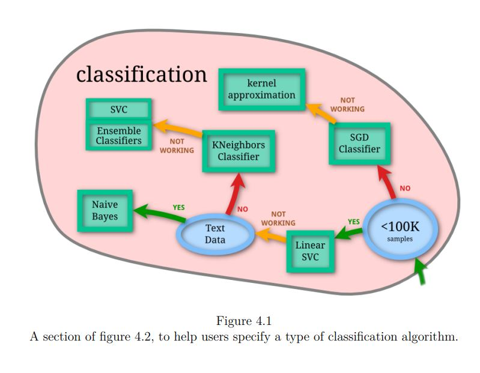

# Antrenarea și testarea

Dupa extragerea procesului, examenele nu mai arată a cod, ci doar valori numerice. Să luăm ca exemplu poza de mai jos

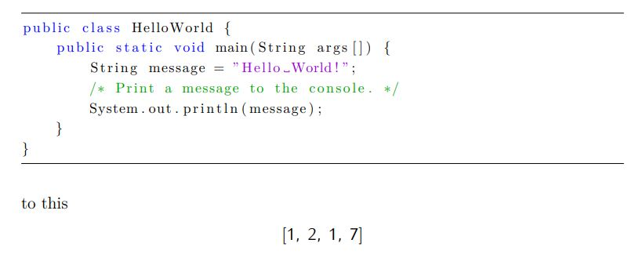

Antrenarea reprezintă, in exemplul nostru, oferirea listelor către un algoritm, impreună cu notele pentru fiecare exemplu, și oferirea notelor acestora. Astfel rămânem cu un clasificator ce ne dorim să găsească un pattern între primul submit, al doilea s.a.m.d

Testarea este atunci când ii oferim clasificatorului un set nou de liste și verificăm răspunsul acestuia cu unul pe care îl considerăm deja corect.

# Grid-search and scoring

Orice tip de software ar fi, scopul este acela de a crea o ustensila mai bună decât cele anterioare. O iterație este completă atunci când o listă de specificații este implementată, și ține de developeri să își dea seama cum să implementeze o specificație nouă. Cu toate acestea, când creezi un instrument de machine learning scopul trebuie sa fie clar, dar drumul către acesta nu va fi. Există mai multe metode cu care putem experimenta, iar pentru acestea, a fost creat grid-search.

# Scoring
Atunci când evaluăm performanța unui algoritm de machine learning este necesar să ne luăm o măsură de învățare și predicție. Scorul reprezintă o predicție pe care algoritmul o face după ce este antrenat.
Prima funcție de evaluare este una default pentru Linear SVc și Naive Bayes, și este un simplu scor de acuratețe. Acesta compară numărul corect de predicții cu numărul total de predicții, și returnează răspunsul. Ex următor are un scor de 0.6

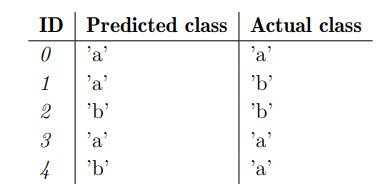

A doua funcție de evaluare este o varietate de evaluare a acurateții, însă aceasta compenseaza faptul că notele nu sunt echivalent distribuite, și că prea multe elemente în prea puține numere de clase pot să încarce algoritmul să observe doar clasele respective. El funcționează astfel:
- Algoritmul este antrenat și testat
- Un scor este oferit fiecărei clase bazat pe acuratețea scorurilor funcției
    Notele de la 1 la 10 sunt numărate și introduse ca scor bazat pe predicțiile făcute
- Fiecare clasă de scor are o valoarea bazată pe disproporția tuturor claselor de elemente

În final, scorul este calculat ca o sumă de valori ale acurateții tuturor claselor.

# Concluzia

State-Of-The-Art-ul Exploreaza posibilitatea de a crea un instrument de evaluare automata pentru a face evaluarea examenelor de programare mai eficienta și mai ușoară. Trei întrebări au fost puse la început, și la toate am primit răspunsul:

Î: Ce fel de evaluator de cod sursă există deja, și cum pot fi folosite în machine learning?

R: Există o varietate de metode folosite pentru a evalua codul sursă, de la ideea de a vedea structura codului și sintaxa, până la a ne focusa pe performanța și output-ul acestuia, și fiecare interpretare are modul ei de a verifica dacă codul este unul corect. Am menționat mai multe metode, acestea fiind utilizate industrial, în scop educativ sau pentru cercetare.

Î: Ce funcții și metrice pot fi folosite pentru acest obiectiv?

R: Scopul unui examen este de a oferi o evaluare cât mai obiectivă posibil și pentru a realiza acest lucru, am selectat un set de caracteristici obiective pe care să le folosim ca bază pentru procesul de evaluare. Aceste caracteristici constau în măsuri Halstead, două scoruri de similaritate și patru metrici menite să verifice discrepanțe între un task și soluția prezentată de un student.

Î: Cum ar putea machine learning sa funcționeze când evaluează examenele?

R: Pentru a răspunde la această întrebare a fost efectuat un experiment folosind sistemul descris pe un set de date constând din trimiteri de examen ale TDT4100 din 2017. Rezultatele acestui experiment au fost neconcludente, ceea ce credem că provin din faptul că setul de date a fost neoptim și a ajuns să se adapteze prea mult la clasificator.

#

#

# O alta modalitate de adunare de date propusa intr-o lucrare separata

## Prezentare generala
Pe parcursul unui curs semestrial de tehnologii web, studenții au avut un proiect împărțit în patru iterații. Fiecare iterație are mai multe sarcini. Iterațiile durează două săptămâni și, după o iterație, studenții trebuie să-și posteze soluția într-un depozit privat. Arhivele private sunt folosite astfel încât studenții să nu poată vedea soluțiile celorlalti.
Fiecare iterație este testată folosind un test automat. Testele automate sunt concepute astfel încât să detecteze cele mai frecvente erori, dar adesea nu pot spune de ce este prezentă o eroare. Autorii unor lucrari de cercetare in acest domeniu spun că studenții începători au adesea dificultati să detecteze unde apare eroarea de cod atunci când obțin un test eșuat. Ei propun o soluție care oferă feedback automat unde este o eroare în cod și cum se remediază, dar are limitări. Descrierea proiectului trebuie să fie foarte detaliată, iar erorile trebuie să fie previzibile. Nu putem îndeplini această cerință, deoarece nu toate sarcinile pot fi date astfel. Unele dintre Task-urile din curs au un grad mai mare de libertate de implementare. Cursul este un curs de ultimul an și studenții trebuie să demonstreze o anumită independență în rezolvarea sarcinilor lor. Dacă sarcinile sunt prea strict formulate, atunci este greu să scrie o definiție a sarcinii în care o parte a soluției sau a unei metode nu este dezvăluită.
Există și o problemă cu testele automate prea stricte. Dacă testele sunt prea stricte sau cu granulație grosieră, atunci studenții care au o soluție parțial corectă vor primi 0 puncte. Testele trebuie să fie detaliate, astfel încât să poată detecta mai multe erori care sunt prezente, altfel, dacă este raportată o singură eroare mare, elevii nu pot învăța prea multe din ea.
O altă soluție pentru feedback este prin evaluarea de la egal la egal. În acest caz, studenții care au lucrat la sarcini evaluează alte soluții la aceleași sarcini de la colegii lor. În acest caz, evaluarea este mai subiectivă decât la testele automate.

## B. Prezentare succinta a literaturilor gasite
Există multe lucrări care descriu utilizarea notării automate a sarcinilor de programare. În lucrarea [6], autorii descriu metoda de notare în care studenții scriu teste, iar codul și sistemul de notare validează performanța lor de testare. Performanța testării este evaluată în trei moduri: validitatea testelor, caracterul complet al testelor și calitatea codului.
În lucrarea [7] autorii propun o metodă în care studenții revizuiesc soluțiile altor studenți scriind teste și rulând-le. Evaluatorii primesc programe compilate, nu un cod al soluției.
În lucrarea [8], autorii oferă o revizuire sistematică a literaturii de specialitate a instrumentelor de evaluare pentru programarea sarcinilor. Ei identifică trei tipuri de abordări: abordări centrate pe instructor, abordări centrate pe elev și hibride. În cercetarea lor, autorii au descoperit că majoritatea instrumentelor acceptă limbaje de programare Java sau C++, ei nu au menționat suportul pentru instrumente pentru limbaje orientate pe web (JavaScript, HTML și CSS).
Există, de asemenea, multe lucrări care descriu feedback-ul de la egal la egal și evaluarea în predare.
În lucrarea [9] autorii propun o soluție pentru feedback-ul intre studenti. Această soluție este folosită pentru a evalua întrebările de discuție care ajută elevii în procesul de învățare.
În lucrarea [10] autorii descriu câteva linii directoare pentru sarcina de evaluare. Grupurile de evaluare nu ar trebui să fie prea mari, iar evaluatorii nu ar trebui să aibă multe dimensiuni de evaluat.
Lucrarea [11] concluzionează că evaluarea de la egal la egal ar trebui utilizată nu numai pentru notarea elevilor, ci și pentru îmbunătățirea procesului de învățare și a reflecției critice.

Combinând toate beneficiile revizuirii codului, testelor automate obiective și feedback-ului colegilor, s-a incercat ajutarea studenților ca să-și recunoască și să-și corecteze greșelile în cod. În acest scop, s-a creat o soluție software și câteva metode care le permit studenților să-și revizuiască munca reciproc și să-și ierarească colegii. Acest clasament a arătat o corelație moderată spre mare cu punctele obținute prin testele automate.

## METODE DE REVIZIE ȘI SOFTWARE
A.
Sarcinile elevului
După fiecare termen limită, toți studenții au primit 5 proiecte de evaluat și clasat. Ei evaluează doar iterația curentă.
Regulile de evaluare, enumerate după importanță, sunt completitatea iterației, numărul de erori și calitatea codului. Pentru fiecare proiect, un student scrie comentarii și clasifică proiectele după calitate, unde primul proiect este cel mai bun și ultimul proiect este cel mai prost.
Studenții au la dispoziție câteva zile pentru a analiza, evalua și clasifica proiectele. După expirarea termenului limită pentru o evaluare, recenziile sunt analizate și toți studenții primesc comentarii de la colegiile lor și rangul mediu al proiectului lor.
Elevii își păstrează proiectele ca depozite private pe BitBucket. Doar profesorul și elevul au acces la depozit. Iterațiile proiectului sunt pe ramuri individuale. Profesorul rulează un script node.js care primește o listă a tuturor depozitelor elevilor cu ramura corectă folosind API-ul web BitBucket
După ce lista este compusă, profesorul folosește un script bash care clonează toate depozitele din listă. Fiecare depozit este apoi repartizat aleatoriu cinci studenți diferiți, astfel încât toți să primească cinci proiecte diferite.
Când se termină alocarea proiectelor, elevii primesc proiecte pentru revizuire ca fișier zip pe ramura iterației curente.

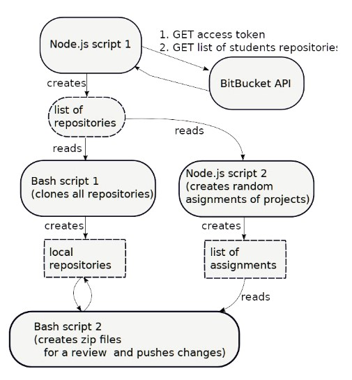

Fișierele Readme și orice fișiere care conțin informații despre identitatea studentului sunt eliminate din proiecte. Acest lucru se face pentru a reduce potențialul favoritism sau conflicte într-un proces de evaluare intre colegi.

B.
Elevii folosesc aplicația desktop pentru a se conecta la sistem. După conectare, ei își pot vedea toate recenziile și, la sfârșitul termenului de revizuire, toate recenziile de la colegii lor pentru proiectul lor. Interfața cu utilizatorul este simplă și sunt afișate doar puține informații relevante.

Elevii clasează cinci proiecte după calitate, de la cel mai bun la cel mai rău. Proiectele sunt denumite cu litere de la A la E. Pentru fiecare proiect există o zonă de text pentru comentarii și există cinci liste derulante cu nume de proiecte care reprezintă rangul unui proiect.

C. Analiza rezultatelor
Când o iterație se termină, proiectele sunt testate prin teste automate. Testele detectează erori într-un proiect, iar proiectul este marcat astfel încât un proiect fără teste eșuate (fără erori) să obțină toate punctele. Dacă există erori detectate, procentul de teste eșuate este dedus din puncte. Fiecare iterație este marcată cu 10 puncte, unde elevii pot obține 1 punct pentru revizuire. Jumătate din punctajul pe care îl pot obține pentru revizuirea lor și jumătate din punct este calculat folosind clasamentul mediu pe care proiectul lor este clasat.
Clasamentul mediu al unui proiect este calculat ca medie a tuturor nivelurilor de proiect obținute în iterația curentă. Un proiect este clasat de cinci studenți diferiți. Punctul mediu și nota finală sunt apoi comparate pentru fiecare iterație.

In concluzie, evaluarea proiectelor elevilor poate dura mult timp, mai ales dacă clasele au un număr mare de studenți. Feedback-ul din evaluare trebuie să fie adecvat pentru a sprijini procesul de învățare. Evaluarea de la egal la egal poate fi utilizată în cursurile de inginerie software complementară cu un test automat pentru a oferi feedback studenților. Trebuie făcute mai multe cercetări pentru a evalua dacă feedback-ul colegilor îi ajută pe elevi să înțeleagă de ce și cum au eșuat programele lor la testele automate.
Trebuie făcute cercetări suplimentare care să analizeze efectele evaluării de la egal la egal în cursurile de inginerie software asupra calității codului. S-ar putea face o analiză detaliată a modului în care elevii văd feedbackul colegilor ca un instrument complementar testelor automate.

## Propunere

Se poate incerca folosirea acestei metode de notare a proiectelor intre studenti impreuna cu medote de antrenare machine learning si integrarea acestui aspect intr-o aplicatie de predictie a notelor studentior.

## Lucrarile mentionate

[6] Edwards, Stephen H. "Teaching software testing: automatic
grading meets test-first coding." Conference on Object Oriented Programming Systems Languages and Applications: Companion of the 18 th annual ACM SIGPLAN conference on Object oriented programming, systems, languages, and applications. Vol. 26. No. 30. 2003 

[7] Smith, Joanna, et al. "Using peer review to teach software testing." Proceedings of the ninth annual international conference on International computing education research. ACM, 2012. 

[8] Souza, Draylson M., Katia R. Felizardo, and Ellen F. Barbosa. "A systematic literature review of assessment tools for programming assignments." 2016 IEEE 29th International Conference on Software Engineering Education and Training (CSEET). IEEE,
2016. 

[9] P. Ertmer, J. Richardson, B. Belland, D. Camin, P. Connolly, G. Coulthard, K. Lei, and C. Mong. Using peer feedback to enhancethe quality of student online postings: An exploratory study.Journalof Computer-Mediated Communication, 12(2):412
433, 2007. 

[10] Falchikov, Nancy, and Judy Goldfinch. "Student Peer Assessment
in Higher Education: A Meta-Analysis Comparing Peer and Teacher Marks.” Review of Educational Research 70, no. 3
(September 2000): 287-322. 

[11] Liu, Ngar-Fun, and David Carless. "Peer feedback: the learning element of peer assessment." Teaching in Higher education 11, no. 3 (2006): 279-290.